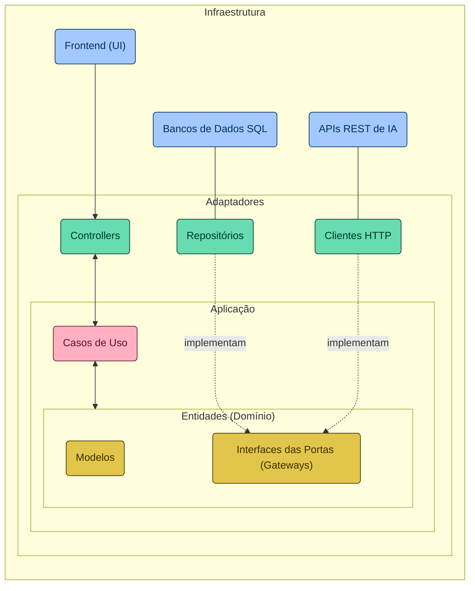

<a name="santander-dev-week-2024"></a>

[![Contributors][contributors-shield]][contributors-url]
[![Forks][forks-shield]][forks-url]
[![Stargazers][stars-shield]][stars-url]
[![Issues][issues-shield]][issues-url]
<!-- [![MIT License][license-shield]][license-url] -->
[![LinkedIn][linkedin-shield]][linkedin-url]


<!-- PROJECT LOGO -->
<br />
<div align="center">
  <a href="https://github.com/luk3mn/santander-dev-week-2024">
    <!--  -->
  </a>

  <h3 align="center">LOL Champions API</h3>
  
  <p align="center">
    Santander Dev Week 2024
    <br />
    <a href="https://github.com/luk3mn/santander-dev-week-2024/README.md"><strong>Explore the docs »</strong></a>
    <br />
    <br />
  </p>
</div>

<!-- TABLE OF CONTENTS -->
<details>
  <summary>Table of Contents</summary>
  <ol>
    <li>
      <a href="#about-the-project">About The Project</a>
      <ul>
        <li><a href="#built-with">Built With</a></li>
      </ul>
    </li>
    <li>
      <a href="#getting-started">Getting Started</a>
      <ul>
        <li><a href="#prerequisites">Prerequisites</a></li>
        <li><a href="#installation">Installation</a></li>
      </ul>
    </li>
    <li><a href="#usage">Usage</a></li>
    <li><a href="#deployment">Deployment</a></li>
    <li><a href="#roadmap">Roadmap</a></li>
    <!-- <li><a href="#license">License</a></li> -->
    <li><a href="#authors">Authors</a></li>
    <li><a href="#feedback">Feedback</a></li>
    <li><a href="#acknowledgments">Acknowledgments</a></li>
  </ol>
</details>


<!-- ABOUT THE PROJECT -->
## About The Project
> Diagram


> Directory Structure
-   `adapters/`: To include adapters to facilitate the communication between the application and external functions (it knows about the Spring)
    -   `in/`: 
    -   `out/`:
-   `application/`: 
-   `domain/`:
    -   `exception/`:
    -   `model/`: 
    -   `ports/`:
-   `Application.java`:

<p align="justify">

  
</p> 


<p align="right">(<a href="#santander-dev-week-2024">back to top</a>)</p>


### Built With

* [![Java][Java]][Java-url]
* [![Spring][Spring]][Spring-url]

<p align="right">(<a href="#santander-dev-week-2024">back to top</a>)</p>


<!-- GETTING STARTED -->
## Getting Started

Here are some important topics about this project and how to replay it.

### Prerequisites

* Java 21

### Installation

_Before starting this application in your local environment, it'll be necessary to proceed with some tasks to reproduce this project._

1. Clone the repo
   ```sh
   git clone https://github.com/luk3mn/santander-dev-week-2024.git
   ```

<p align="right">(<a href="#santander-dev-week-2024">back to top</a>)</p>


<!-- USAGE EXAMPLES -->
## Usage / Examples
<p style="text-align: justify"> 

</p>

```sql
CREATE TABLE IF NOT EXISTS champions (
    id INT AUTO_INCREMENT PRIMARY KEY,
    name VARCHAR(255) NOT NULL,
    role VARCHAR(255) NOT NULL,
    lore TEXT,
    image_url VARCHAR(255)
);

INSERT INTO champions (name, role, lore, image_url) VALUES
    ('Jinx', 'Atirador', 'Uma criminosa impulsiva e maníaca de Zaun, Jinx vive para disseminar o caos sem se preocupar com as consequências. Com um arsenal de armas mortais, ela detona as explosões mais altas e mais luminosas para deixar um rastro de destruição e pânico por onde passa. Jinx abomina o tédio e deixa alegremente sua marca caótica de pandemônio aonde quer que vá.', 'https://ddragon.leagueoflegends.com/cdn/img/champion/splash/Jinx_0.jpg'),
    ('Vi', 'Lutador', 'Antiga criminosa das ruas violentas de Zaun, Vi é uma mulher temível, impulsiva e explosiva que tem muito pouco respeito por autoridades. Após ter crescido completamente só, Vi desenvolveu instintos de sobrevivência extremamente certeiros e um senso de humor extremamente ácido. Agora trabalhando com os Vigias de Piltover para manter a paz, ela porta poderosas manoplas hextec capazes de esmagar paredes e suspeitos com a mesma facilidade.', 'https://ddragon.leagueoflegends.com/cdn/img/champion/splash/Vi_0.jpg'),
    ('Ekko', 'Assassino', 'Um prodígio das ruas violentas de Zaun, Ekko manipula o tempo para reverter qualquer situação a seu favor. Usando sua própria invenção, o Revo-Z, ele explora as possíveis bifurcações da realidade para criar o momento perfeito. Embora valorize muito sua liberdade, quando algo ameaça seus amigos, ele não mede esforços para defendê-los. Para meros observadores, Ekko parece conseguir o impossível sempre de primeira.', 'https://ddragon.leagueoflegends.com/cdn/img/champion/splash/Ekko_0.jpg'),
    ('Caitlyn', 'Atirador', 'Conhecida como sua melhor pacificadora, Caitlyn também é a melhor escolha de Piltover para livrar a cidade de seus elementos criminosos elusivos. É comum que ela faça dupla com Vi, agindo como um contraponto de calmaria para a natureza impetuosa de sua parceira. Mesmo carregando um rifle hextec único, a arma mais poderosa de Caitlyn é seu intelecto superior, que permite que ela prepare elaboradas armadilhas para qualquer fora da lei tolo o suficiente para operar na Cidade do Progresso.', 'https://ddragon.leagueoflegends.com/cdn/img/champion/splash/Caitlyn_0.jpg'),
    ('Jayce', 'Lutador', 'Jayce é um brilhante inventor que dedicou sua vida a defender Piltover e sua implacável busca pelo progresso. Com seu martelo hextech transformador em mãos, Jayce usa sua força, coragem e considerável inteligência para proteger sua cidade natal. Embora seja aclamado pela cidade como herói, ele não gosta muito da atenção que o heroísmo traz. Mesmo assim, o coração de Jayce está no lugar certo e até aqueles que invejam suas habilidades naturais são gratos à forma como ele protege a Cidade do Progresso.', 'https://ddragon.leagueoflegends.com/cdn/img/champion/splash/Jayce_0.jpg'),
    ('Viktor', 'Mago', 'Viktor, o arauto de uma nova era de tecnologia, devotou sua vida ao avanço da humanidade. Um idealista que busca elevar o povo de Zaun a um novo nível de compreensão, ele acredita que somente ao aceitar a evolução gloriosa da tecnologia será possível que a humanidade alcance seu verdadeiro potencial. Com um corpo melhorado por aço e ciência, Viktor é zeloso na sua busca por este brilhante futuro.', 'https://ddragon.leagueoflegends.com/cdn/img/champion/splash/Viktor_0.jpg'),
    ('Heimerdinger', 'Mago', 'Um cientista brilhante, mesmo que excêntrico, o Professor Cecil B. Heimerdinger é um dos inventores mais inovadores e estimados que Piltover já conheceu. Incansável em seu trabalho ao ponto da obsessão neurótica, ele busca responder as questões mais impenetráveis do universo. Apesar de suas teorias frequentemente parecerem obscuras e esotéricas, Heimerdinger produziu algumas das máquinas mais miraculosas, sem mencionar letais, de Piltover e ajusta constantemente suas invenções para torná-las ainda mais eficientes.', 'https://ddragon.leagueoflegends.com/cdn/img/champion/splash/Heimerdinger_0.jpg'),
    ('Singed', 'Tanque', 'Singed é um alquimista zaunita de intelecto inigualável, que devotou sua vida a ultrapassar os limites do conhecimento; e nenhum preço, nem sua própria sanidade, é alto demais. Existe cura para sua loucura? Suas misturas raramente falham, mas, para muitos, Singed perdeu qualquer noção da humanidade, deixando uma trilha tóxica de miséria e terror no seu caminho.', 'https://ddragon.leagueoflegends.com/cdn/img/champion/splash/Singed_0.jpg'),
    ('Ryze', 'Mago', 'Considerado pela grande maioria como o mago mais habilidoso de Runeterra, Ryze é um arquimago ancião e amargo que carrega um enorme peso. Dotado de um enorme poder arcano e de uma notável estrutura física, ele busca incansavelmente pelas Runas Globais, que são fragmentos de magia pura que um dia criaram o mundo a partir do nada. Ele deve recuperar esses artefatos antes que eles caiam em mãos erradas, pois Ryze conhece bem os horrores que eles podem infligir em Runeterra.', 'https://ddragon.leagueoflegends.com/cdn/img/champion/splash/Ryze_0.jpg'),
    ('Master Yi', 'Assassino', 'Master Yi treinou seu corpo e afiou sua mente para que pensamento e ação se tornassem quase um só. Embora ele prefira recorrer à violência como último recurso, a leveza e a velocidade de sua espada garantem uma resolução sempre veloz. Como um dos últimos praticantes da arte ioniana do Wuju, Yi dedicou sua vida a preservar o legado de seu povo, avaliando potenciais discípulos com as Sete Lentes da Perspicácia para identificar qual deles era o mais digno.', 'https://ddragon.leagueoflegends.com/cdn/img/champion/splash/MasterYi_0.jpg'),
    ('Garen', 'Lutador', 'Um guerreiro nobre e orgulhoso, Garen faz parte da Vanguarda Destemida. Popular entre seus companheiros e respeitado o suficiente por seus inimigos, sua reputação é nada mais do que o esperado de um herdeiro da prestigiosa família Stemmaguarda, encarregada de defender Demacia e seus ideais. Vestido com uma armadura resistente à magia e empunhando uma poderosa espada, Garen está sempre pronto para confrontar magos e feiticeiros no campo de batalha, em um verdadeiro furacão de aço virtuoso.', 'https://ddragon.leagueoflegends.com/cdn/img/champion/splash/Garen_0.jpg'),
    ('Teemo', 'Atirador', 'Indiferente até aos obstáculos mais perigosos e ameaçadores, Teemo vasculha o mundo com infinito entusiasmo e animação. Um yordle com uma inabalável moral que se orgulha de seguir o Código dos Escoteiros de Bandópolis, às vezes com tanta dedicação que não se toca das possíveis consequências de suas ações. Embora alguns duvidem da existência dos escoteiros, uma coisa é certa: nunca se deve duvidar das convicções de Teemo.', 'https://ddragon.leagueoflegends.com/cdn/img/champion/splash/Teemo_0.jpg');
```

<!-- ### Screenshots -->


## Deployment

To deploy this project run

* AWS Beanstalk

<!-- ROADMAP -->
## Roadmap

- [x] Project Init
- [ ] Building an API with LOL champions
- [ ] Improving the API with Artificial Intelligence
- [ ] Using HTML / CSS / Javascript to request LOL champions API

<p align="right">(<a href="#santander-dev-week-2024">back to top</a>)</p>

<!-- ## Lessons Learned

<p style="text-align: justify"> 
</p> -->

<!-- LICENSE -->
## License

<!-- Distributed under the MIT License. See `LICENSE.txt` for more information.

<p align="right">(<a href="#santander-dev-week-2024">back to top</a>)</p> -->


<!-- CONTACT -->
## Authors

- username: [@luk3mn](https://www.github.com/luk3mn)

## Feedback

If you have any feedback, please reach out to us at lucasnunes2030@gmail.com

> Project Link: [https://github.com/luk3mn/santander-dev-week-2024](https://github.com/luk3mn/santander-dev-week-2024)

<p align="right">(<a href="#santander-dev-week-2024">back to top</a>)</p>


<!-- ACKNOWLEDGMENTS -->
## Acknowledgments

* [Digital Innovation One](https://www.dio.me/)

<p align="right">(<a href="#santander-dev-week-2024">back to top</a>)</p>


<!-- MARKDOWN LINKS & IMAGES -->
<!-- https://www.markdownguide.org/basic-syntax/#reference-style-links -->
[contributors-shield]: https://img.shields.io/github/contributors/luk3mn/santander-dev-week-2024.svg?style=for-the-badge
[contributors-url]: https://github.com/luk3mn/santander-dev-week-2024/graphs/contributors
[issues-shield]: https://img.shields.io/github/issues/luk3mn/santander-dev-week-2024.svg?style=for-the-badge
[issues-url]: https://github.com/luk3mn/santander-dev-week-2024/issues
[forks-shield]: https://img.shields.io/github/forks/luk3mn/santander-dev-week-2024.svg?style=for-the-badge
[forks-url]: https://github.com/luk3mn/santander-dev-week-2024/network/members
[stars-shield]: https://img.shields.io/github/stars/luk3mn/santander-dev-week-2024.svg?style=for-the-badge
[stars-url]: https://github.com/luk3mn/santander-dev-week-2024/stargazers
[license-shield]: https://img.shields.io/github/license/othneildrew/Best-README-Template.svg?style=for-the-badge
[license-url]: https://github.com/luk3mn/santander-dev-week-2024/blob/master/LICENSE
[linkedin-shield]: https://img.shields.io/badge/-LinkedIn-black.svg?style=for-the-badge&logo=linkedin&colorB=555
[linkedin-url]: https://www.linkedin.com/in/lucasmaues/
[general-code-screenshot]: assets/general-project.png

<!-- Stack Shields -->
[Java]: https://img.shields.io/badge/Java-E02027?style=for-the-badge&logo=java&logoColor=ffffff
[Java-url]: https://www.java.com/en/
[Spring]: https://img.shields.io/badge/SrpingBoot-6DB33F?style=for-the-badge&logo=springboot&logoColor=ffffff
[Spring-url]: https://spring.io/projects/spring-boot